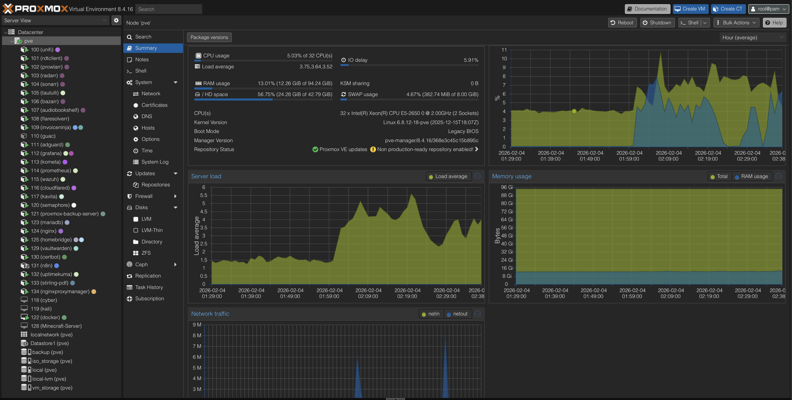

# Virtualization Platform – Proxmox Infrastructure Design

The homelab virtualization environment is built on [Proxmox VE](chatgpt://generic-entity?number=0) and hosts a large-scale container-based service architecture with targeted virtual machines.

The infrastructure was initially deployed on VMware ESXi in order to learn enterprise hypervisors, then fully migrated to Proxmox VE to benefit from native container support, flexibility, and modern infrastructure workflows.

---

## Virtualization Strategy

The platform uses a hybrid model:

### LXC Containers (Primary Workloads)

LXC containers are used for the majority of production services including:

- networking services  
- web platforms  
- monitoring and observability  
- automation tools  
- media services  
- databases  

Key benefits:

- near bare-metal performance  
- minimal resource overhead  
- fast deployment  
- strong service isolation  
- scalable micro-service architecture  

This reflects modern infrastructure and DevOps-style deployments.

---

### Virtual Machines (Targeted Use Cases)

Virtual machines are reserved for workloads requiring full OS environments:

- cybersecurity lab environments  
- Kali Linux testing  
- operating system experimentation  
- specific application requirements  

This ensures flexibility while maintaining performance efficiency.

---

## Service Isolation Model

Each major system component runs in its own container or VM:

- reverse proxy  
- DNS filtering  
- monitoring stack  
- automation platforms  
- databases  
- application services  

This design provides:

- fault isolation  
- easier troubleshooting  
- improved security boundaries  
- independent scaling  
- clean infrastructure organization  

---

## Migration Experience

The platform evolution included:

- initial deployment on VMware ESXi  
- comparison of hypervisor environments  
- full migration to Proxmox VE  
- restructuring of workloads into LXC containers  

This provided hands-on experience with:

- enterprise virtualization platforms  
- hypervisor migration planning  
- workload optimization  
- modern container-based infrastructure  

---

## Infrastructure Advantages

- centralized management  
- high service density  
- efficient resource utilization  
- scalable architecture  
- production-style infrastructure layout  

---

## Real-World Skills Demonstrated

- enterprise virtualization design  
- container-based infrastructure management  
- hypervisor migration  
- service isolation strategies  
- performance optimization  
- infrastructure scalability planning  

---

## Summary

This Proxmox-based virtualization platform replicates real-world enterprise environments using modern container-focused infrastructure design while maintaining the flexibility of full virtual machines when required.
