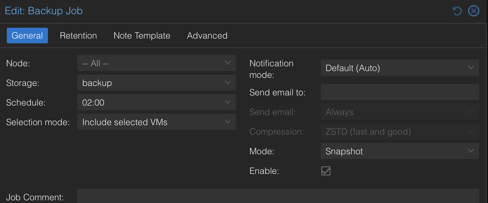
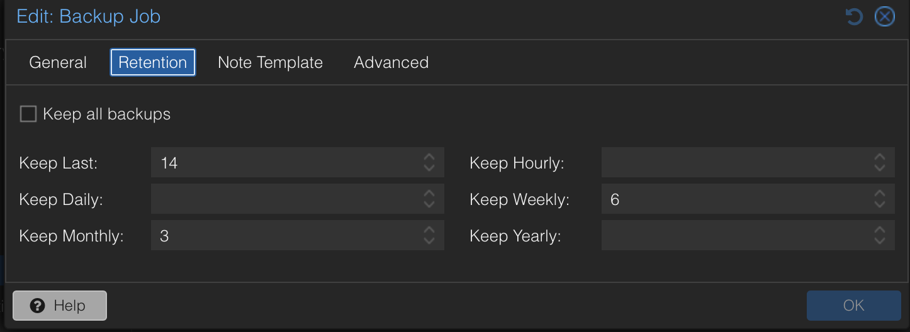

# Backup & Disaster Recovery – Proxmox Backup Server Strategy

This homelab implements an enterprise-style backup strategy using [Proxmox Backup Server](chatgpt://generic-entity?number=0) to protect virtualized workloads hosted on [Proxmox VE](chatgpt://generic-entity?number=1).

The objective is to ensure consistent recovery points, automated scheduling, and controlled retention.

---

## Backup Platform

- Centralized backups handled by Proxmox Backup Server (PBS)
- Backup jobs managed from the Proxmox VE interface
- Backups use snapshot mode to avoid downtime

## Offsite Storage Architecture (NFS Backend)

Backup data is stored on a dedicated storage server running TrueNAS and mounted on Proxmox Backup Server via an NFS share.

This design ensures:

- physical separation between compute and backup storage  
- protection against host-level failures  
- centralized high-capacity storage for long-term retention  
- enterprise-style backup architecture  

The NFS share serves as the primary backup datastore for PBS, allowing scalable and reliable storage independent from the virtualization host.

---

## Architecture Benefits

- backup server isolated from production workloads  
- storage optimized for large backup datasets  
- easier capacity expansion  
- improved disaster recovery resilience  

---

## Automated Backup Job

Key settings:
- Schedule: **02:00**
- Mode: **Snapshot**
- Compression: **ZSTD (fast and good)**
- Selection: **Include selected VMs/CTs**
- Notifications: default / configurable per job

This provides unattended backups during low-usage hours.

---

## Retention Policy

Retention rules implemented:
- **Keep Last:** 14
- **Keep Weekly:** 6
- **Keep Monthly:** 3

This retention model balances:
- frequent short-term recovery points
- medium-term weekly restore options
- longer-term monthly recovery options
while controlling storage growth.

---

## Operational Benefits

- Automated backups with consistent scheduling
- Minimal service impact through snapshot backups
- Storage optimization via compression + retention
- Clear restore strategy for service failures or misconfigurations

---

## Real-World Skills Demonstrated

- Backup strategy design
- Retention policy planning
- Snapshot-based backup workflows
- Disaster recovery mindset (restore-ready infrastructure)

---

## Summary

This backup strategy provides enterprise-like protection for a multi-service homelab environment by combining automated scheduling, snapshot backups, and structured retention policies.
