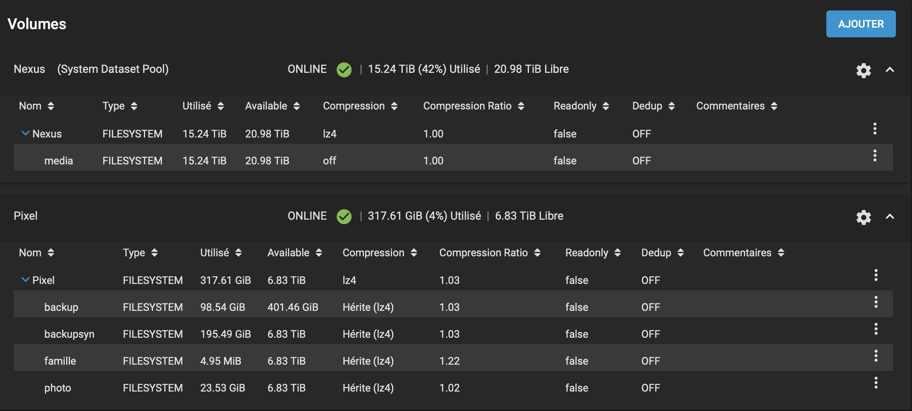
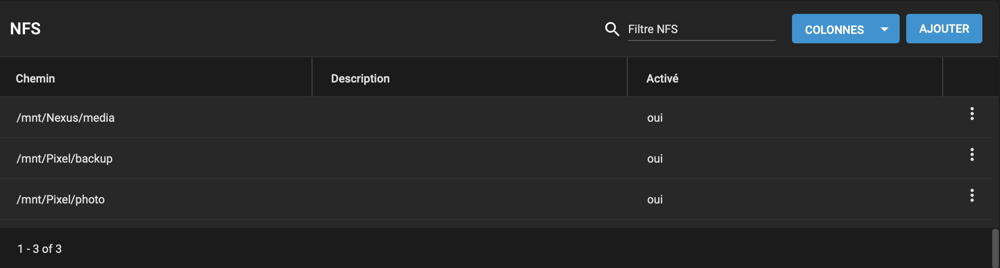
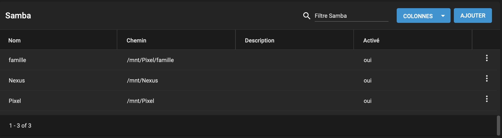

# Storage Architecture – Centralized TrueNAS Platform

The homelab storage layer is built on a dedicated server running [TrueNAS](chatgpt://generic-entity?number=0), providing centralized storage for media, backups, personal data, and family file sharing.

The design follows enterprise principles by separating storage from compute workloads and organizing data by purpose.

---

## Storage Pool Structure

The environment is organized into two main storage volumes:

### Nexus Pool – Media Storage

This volume is dedicated to high-capacity media workloads:

- ripped movie collection from physical discs  
- personal music library  
- long-term media archives  

NFS shares are provided to:

- the Plex server  
- the personal workstation  

This allows high-throughput streaming and centralized media access.

---

### Pixel Pool – Critical & Personal Data

This volume contains structured datasets for important data and backups:

#### PBS Backup Dataset
- primary backup storage for Proxmox Backup Server  
- receives snapshot-based VM and LXC backups via NFS  

#### Synology Backup Dataset
- rsync backups from the Synology NAS  
- secondary protection layer for personal documents  

#### Family Dataset
- shared NFS storage accessible by family members  
- individual user credentials for each person  
- controlled access and data isolation  

#### Photo Dataset
- personal and family photo storage  
- centralized archive for long-term preservation  

---

---

## NFS Integration

TrueNAS provides NFS exports for infrastructure workloads including media services and backup storage.

This enables:

- high-performance shared storage  
- centralized backup repositories  
- clean separation between compute and storage  

---

---

## Access Control & Security

- NFS shares segmented by dataset purpose  
- per-user authentication for family storage  
- separation between media, backups, and personal data  
- controlled access between servers and workstations  

This ensures data privacy and security across all storage usage.

---

---

## Offsite Cloud Backup (S3)

In addition to local storage, the Pixel volume is backed up weekly to cloud object storage using an S3-compatible backend powered by [Amazon S3](chatgpt://generic-entity?number=1).

This offsite backup layer provides:

- protection against total site failure  
- long-term disaster recovery capability  
- geographically separated data copies  
- enterprise-style hybrid backup architecture  

Critical personal data, family files, and backup datasets are therefore protected both locally and in the cloud.

---

## Synology Integration (Personal Cloud)

A separate NAS running [Synology](chatgpt://generic-entity?number=2) is used as a personal cloud platform:

- document storage  
- real-time synchronization across devices  
- Google Drive–style workflow  

Its data is regularly backed up to TrueNAS using rsync for redundancy.

---

## Infrastructure Benefits

- centralized storage management  
- compute and storage separation  
- scalable dataset architecture  
- secure multi-user access  
- multi-layer backup strategy  
- optimized performance per workload  

---

## Real-World Skills Demonstrated

- NAS platform deployment and management  
- ZFS dataset organization strategy  
- NFS network storage configuration  
- multi-user access control  
- backup integration design  
- hybrid NAS ecosystem management  

---

## Summary

This TrueNAS-based storage platform provides scalable, secure, and purpose-driven storage for media services, backups, personal data, and family file sharing while integrating secondary NAS synchronization and offsite cloud backups for full disaster recovery coverage.
